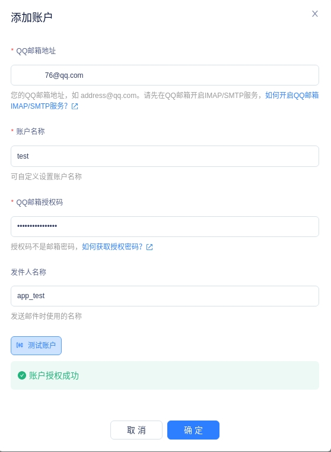
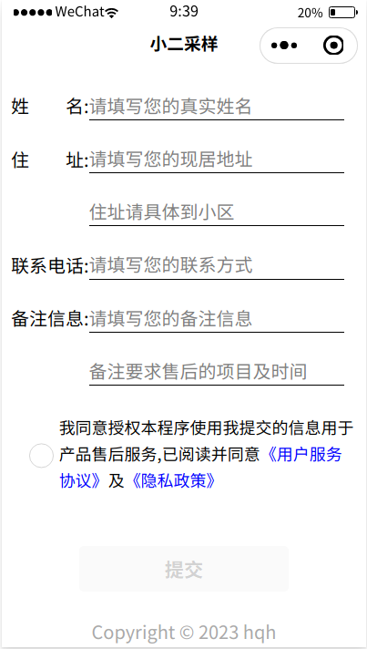
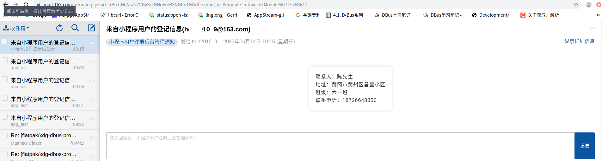
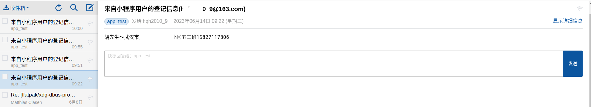

# 说明

这是一个小程序将用户注册信息以邮件的形式发送到目标邮箱.常用解决方案是使用小程序云开发云函数（需要收费）．本方案是采用腾讯轻联的webhook解决方案．

# 使用方式

需要先注册腾讯轻联，开通webhook后台，然后按照webhook的要求设置邮箱帐号．部分设置界面如下图：

配置webhook(注意获取到webhook的url地址后，可以先使用postman或apipost或小程序发送post数据，测试并预览，这样第2步和第三步才能获取到webhook配置的数据)

配置好后，配置发送邮箱(QQ邮箱授权码需要提前手动开通邮件服务后获取)

配置发送给目标邮件的正文，邮件正文类型可以为文本或HTML，文本格式的邮件正文，目标收件箱中显示格式不太友好，HTML可以自定义显示格式

小程序页面

收件箱页面

# 参考文档

* [微信小程序入门教程](https://www.ruanyifeng.com/blog/2020/10/wechat-miniprogram-tutorial-part-one.html)

* [flex布局详解](https://blog.csdn.net/wwwjjjjj666/article/details/128033184)

* [微信小程序自定义导航栏](https://juejin.cn/post/6844903864987041799)

https://qinglian.tencent.com/docs/applications/qq-mail/

https://juejin.cn/post/6993149893120360484

https://github.com/Shay0921/header-navbar
